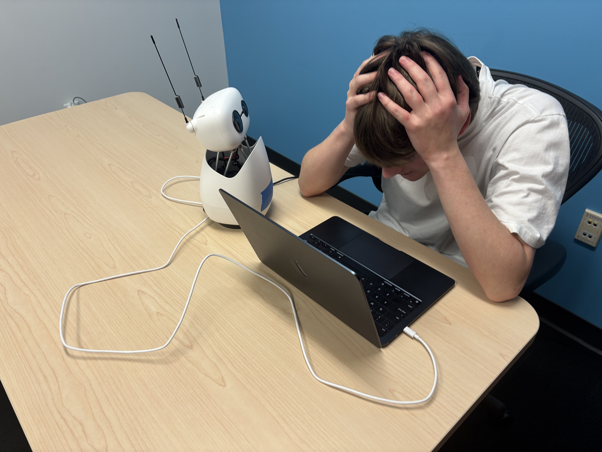
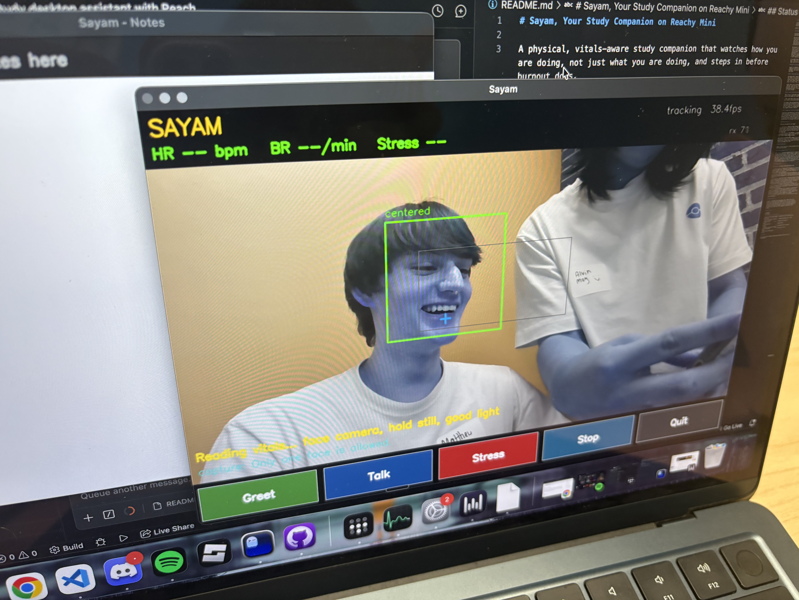

# Sayam, Your Study Companion on Reachy Mini

A physical, vitals-aware study companion that watches how you are doing, not just what you are doing, and steps in before burnout does.

Built for the Presage Technologies Hackathon.

## Demo

<p>
  
  
</p>

**▶ Watch the demo:** [docs/media/sayam-demo.mp4](docs/media/sayam-demo.mp4)

<video src="docs/media/sayam-demo.mp4" controls width="640"></video>

## Inspiration

Everyone has a study setup. Almost no one has something watching out for them while they use it.

We have all had those late-night grind sessions where you are three hours deep, your heart is racing, your shoulders are at your ears, and you do not even notice you stopped absorbing anything an hour ago. Timers and to-do apps track tasks, but they are blind to the person doing them. They cannot tell the difference between focused flow and quiet panic.

We wanted a companion that could tell the difference. One that lives on your desk, sees you, reads your body, and actually reacts when your stress climbs. The breakthrough was realizing that Presage's video-to-vitals technology meant we did not need wearables or a chest strap. A camera is enough. Reachy Mini gave that camera a face, a voice, and a personality, turning a stream of biometric data into something that feels like a friend nudging you to breathe.

So we made Sayam: a small robot that sits with you while you work, reads your heart rate and breathing from a plain camera feed, and tells you when to take a break.

## What It Does and How We Use It

Sayam is a desktop companion built on the Reachy Mini robot. It combines contactless vitals sensing, face tracking, expressive movement, and spoken voice into a single physical presence on your desk.

### It reads how you are feeling, without any wearables

The Reachy Mini camera streams video of you while you study. That feed is processed by the Presage SmartSpectra SDK, which converts plain video into live vitals: heart rate, breathing rate, and a heart-rate-variability stress index (Baevsky). No watch, no chest strap, just the camera already on the robot.

Sayam learns your resting heart rate over the first several readings, then watches for when you deviate from that personal baseline. When your heart rate climbs well above resting, your breathing quickens, or your stress index spikes, Sayam decides you look stressed.

### It reacts physically and out loud

When stress is detected, Sayam leans in with a concerned gesture and speaks up through its own speaker:

> "Hey, your heart rate is up and you have been at it a while. Let's take a five-minute break."

The spoken lines are generated with ElevenLabs text-to-speech and played back through the robot's speaker, so a check-in lands as a physical, vocal presence rather than a notification you will ignore. A cooldown keeps Sayam from nagging, so it only speaks up when it matters.

### It keeps eye contact and feels alive

Sayam uses face detection to follow you. It holds still and gently recenters on you when you drift out of frame, keeping your face and chest in view so the vitals reading stays good. Between events it idles with a soft breathing sway and occasional quirks such as a head tilt, a glance, a nod, or an antenna perk, so it always feels alive rather than frozen.

### How we run it

Quickest path — one command (starts the Reachy Mini daemon, waits for the robot, and launches the app):

```bash
bash run_sayam.sh
```

There are two ways to run Sayam:

- `live_view.py` opens a window showing the robot camera with a face box and a live vitals overlay (heart rate, breathing rate, stress level), plus on-screen buttons to greet, trigger a demo stress reaction, start or stop the robot, and quit. This is the main demo app.
- `orchestrator.py` runs headless: it greets you, then continuously monitors your vitals and reacts on its own when your stress climbs, with no window.

Both require the Reachy Mini daemon to be running and a Presage API key in a local `.env` file. ElevenLabs credentials enable spoken voice; without them, Sayam falls back to printing its lines so the demo still runs.

## How It Was Built

Sayam is split into a C++ vitals producer and a Python brain that drives the robot.

### Vitals producer (C++)

The `vitals/` directory holds a thin C++ wrapper around the Presage SmartSpectra C++ SDK. It opens a camera by device index (the Reachy Mini camera is index 1 on our Mac, and macOS lets the robot and the vitals process share it), runs the SmartSpectra pipeline, and streams the resulting metrics to stdout as line-delimited JSON, one object per line. Human-readable logs go to stderr so the parser can ignore them. It is built with CMake and a C++20 compiler.

### Python brain

The `sayam/` directory holds the Python side:

- `vitals_bridge.py` spawns the C++ binary as a subprocess, reads the JSON lines, and parses each Presage metrics envelope into a simple `VitalsSample` (pulse rate, breathing rate, HRV stress index, and confidences).
- `vision.py` runs OpenCV Haar-cascade face detection, draws the live view and vitals overlay, and aims the robot at your face using a center deadzone so it only moves when you actually drift.
- `liveliness.py` owns the robot's head and antennas through a single roughly 30 Hz control loop, so nothing fights over the motors. It produces the idle breathing sway and random quirks, smoothly follows your face when one is present, and plays expressive gestures such as greet and concerned.
- `control.py` is the demo's single owner of movement and voice. It serializes every action behind one non-blocking lock so gestures never overlap, and handles recentering, greeting, and the stress reaction.
- `voice.py` wraps ElevenLabs text-to-speech. ElevenLabs WAV output is a paid tier, so we request MP3 (available on all tiers) and transcode to WAV locally with ffmpeg, normalizing loudness so the robot's small speaker is clearly audible. The WAV is then played through the Reachy Mini speaker.
- `orchestrator.py` and `live_view.py` are the two entry points described above.

### Stress logic

Stress is decided from the parsed vitals. The orchestrator builds a resting heart-rate baseline from the first readings, then flags stress when heart rate rises a set amount above that baseline or when breathing rate crosses a threshold, gated by a confidence floor and a cooldown. The live view also bands the Baevsky stress index into low, moderate, and high for the overlay.

## Tech Stack

| Component                   | Technology                                               |
| --------------------------- | -------------------------------------------------------- |
| Robot platform and movement | Reachy Mini and the Reachy Mini Python SDK               |
| Vitals and stress sensing   | Presage SmartSpectra C++ SDK (video to vitals)           |
| Camera input                | Reachy Mini onboard camera                               |
| Face detection              | OpenCV Haar cascade                                      |
| Voice                       | ElevenLabs text-to-speech, transcoded to WAV with ffmpeg |
| Vitals producer             | C++20, built with CMake                                  |
| Brain and orchestration     | Python                                                   |

## Status

Built during the Presage Technologies Hackathon and actively in development.
